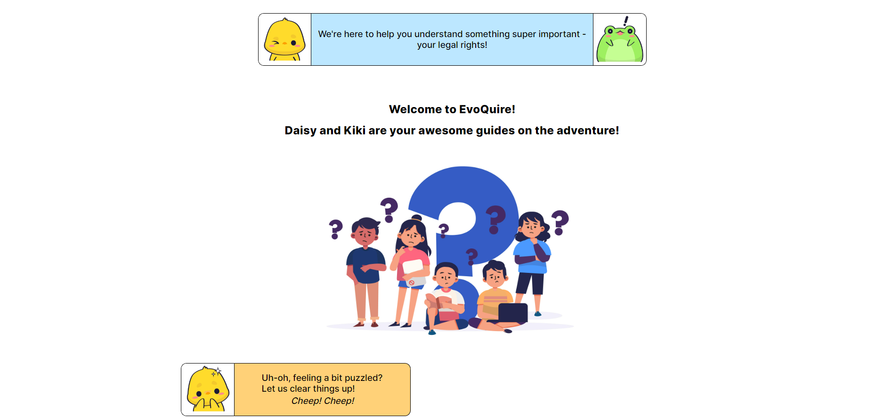

# InterHacktive - EvoQuire

  

# EvoQuire
# Unlocking Legal Wisdom for Young Explorers

<b><a align="center" href="https://www.youtube.com/watch?v=wQ2R2FrZ1ro">Watch Demo Video</a></b>
   
  <b><a a align="center" href="https://arnab-129.github.io/EvoQuire/">Live</a><b>

  

    Use this readme for getting stared with this project
     
    <a href="https://github.com/Arnab-129/EvoQuire/"><strong>docs »</strong></a>
     

<!-- TABLE OF CONTENTS -->

  
Table of Contents

  <ol>
    <li>
      <a href="#about-the-project">About The Project</a>
      <ul>
        <li><a href="#built-with">Built With</a></li>
      </ul>
    </li>
    <li><a href="#contributing">Contributing</a></li>
    <li><a href="#contact">Contact</a></li>
    <li><a href="#acknowledgments">Acknowledgments</a></li>
  </ol>

## About The Project:

### Preview:

### 💭Inspiration :

- The inspiration for our project, EvoQuire, stems from a deep-rooted belief in the transformative power of knowledge. Witnessing the gaps in legal education for children, we were motivated to create a solution that empowers young minds with an understanding of their rights. 
- The desire to bridge this educational divide and equip the next generation with essential legal insights served as the driving force behind EvoQuire. 
- Inspired by the potential to foster responsible and informed citizens, we embarked on a journey to make legal concepts accessible, engaging, and relevant to children aged 10 to 15. 
- Our project is guided by the vision of empowering young learners with the confidence to navigate the complexities of the legal world, ultimately contributing to a fair and just society.

### 💡What problem does the project solve?
- EvoQuire breaks down intricate legal concepts into kid-friendly explanations, making it easier for children to grasp their rights.
- Addressing the lack of age-appropriate legal education, EvoQuire provides an interactive platform tailored to children's needs.
- By educating children about their legal rights, EvoQuire empowers them to make informed decisions and navigate various situations confidently.
- EvoQuire serves as a bridge, helping parents and guardians facilitate discussions about legal rights effectively and strengthen family connections.

### 💀 Challenges we ran into:
- Designing the UI using Figma was challenging as it was our first experience.
- Utilizing a database with Google Sheets and using it as an API was also a challenging task, since we have never used a database before.
- Incorporating slanted divisions and designing dialogue boxes posed challenges in the frontend development

### 🔮 What's Next For Our Project:
- Optimization and minor bug fixes
- Expand the database to contain more questions
- User authentication

(<a href="#read
<me-top">back to top</a>)

### 💻 Built With

 

(<a href="#readme-top">back to top</a>)

## Contributing

If you have a suggestion that would make this better, please fork the repo and create a pull request. 

1. Fork the Project
2. Create your Feature Branch (`git checkout -b feature/Feature1`)
3. Commit your Changes (`git commit -m 'Add Feature 1'`)
4. Push to the Branch (`git push origin feature/Feature1`)
5. Open a Pull Request

(<a href="#readme-top">back to top</a>)

<!-- ACKNOWLEDGMENTS -->
## Acknowledgments

All vector illustrations from FreePik.

 

## Contributors

<h3>
 <b>Made with ❤️ by Team Limitless</b>  

  
    1. <a href= "https://github.com/EmberTSeal" >Trisha Seal</a> - Design, Database, Frontend
     
    2. <a href= "https://github.com/Arnab-129">Arnab Bose</a> - Frontend Development
 

<h3>

